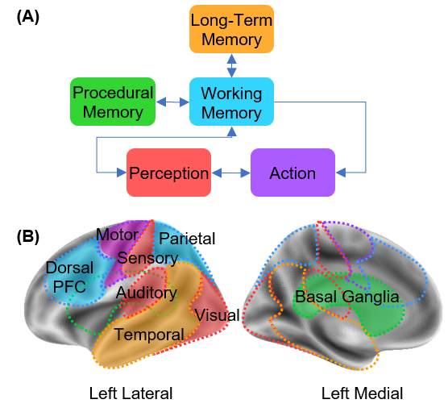

# Testing the Common Model of Cognition as a Brain Architecture

This project aims to examine the feasibility of the Common Model of Cognition as a feasibile, high-level brain architecture. It is a joint project carried out with [John Laird](https://laird.engin.umich.edu/) of the University of Michigan, Christian Lebiere of Carnegie Mellon University, and [Paul Rosenbloom](https://viterbi.usc.edu/directory/faculty/Rosenbloom/Paul) of the University of Southern California.   

## The Common Model of Cognition

The Common Model of Cognition (CMC, formerly known as the "Standard Model of the Mind") is an abstract blueprint of how basic cognitive functionalities can be put together to support human and human-like intelligence:

## Analysis of the Human Connectome Project Data

To test the CMC, each of the components of the CMC is identified with one or more brain regions, and the relationships between them translated into hypothesied patterns of effective connectivity.

These patterns are then translated into a neural network model using Dynamic Causal Modeling.    

These network models can then be tested against a large repository of brain imaging data, the [Human Connectome Project](https://www.humanconnectome.org/)(HCP).

The different folders in this repository describe a number of comparative analysis carried out on the HCP data.

## Publications

This project resulted in the following publications:

### Journal Papers

* Hake, H. S., Sibert, C., & Stocco, A. (2022). Inferring a Cognitive Architecture from Multitask Neuroimaging Data: A Data‐Driven Test of the Common Model of Cognition Using Granger Causality. _Topics in Cognitive Science, 14_(4), 845-859.
* Sibert, C. L., Hake, H. S., & Stocco, A. (2022). The structured mind at rest: Low-frequency oscillations reflect interactive dynamics between spontaneous brain activity and a common architecture for task control. _Frontiers in Neuroscience 16_, 832503. 
* Wapstra, N. J., Ketola, M., Thompson, S., Lee, A., Madhyastha, T., Grabowski, T. J., & Stocco, A. (2022). Increased Basal Ganglia Modulatory Effective Connectivity Observed in Resting-State fMRI in Individuals With Parkinson’s Disease. Frontiers in Aging Neuroscience, 14.
* Stocco, A., Sibert, C., Steine-Hanson, Z., Koh, N., Laird, J. E., Lebiere, C. J., & Rosenbloom, P. (2021). Analysis of the human connectome data supports the notion of a “Common Model of Cognition” for human and human-like intelligence across domains. _NeuroImage, 235_, 118035.
* Wapstra, N. J., Ketola, M., Thompson, S., Lee, A., Madhyastha, T., Grabowski, T. J., & Stocco, A. (2022). Increased Basal Ganglia Modulatory Effective Connectivity Observed in Resting-State fMRI in Individuals With Parkinson’s Disease. _Frontiers in Aging Neuroscience, 14_.

### Conference Proceedings

* Sibert, C., Hake, H., & Stocco, A. (2021). The structured mind at rest: Evidence for the “Common Model of Cognition” in resting state fMRI.  _Proceedings of the 199h International Conference on Cognitive Modeling_.
*	Hake, H., Sibert, C., & Stocco, A. (2021). Inferring a cognitive architecture from multi-task neuroimaging data: A data-driven test of the common model of cognition using Granger causality.  _Proceedings of the 18th International Conference on Cognitive Modeling_. (**Selected as one of the Best Papers at ICCM**)
*	Xu, Y., Prat, C. S., Sense, F., van Rijn, H., & Stocco, A. (2021) Distributed brain connectivity predicts individual differences in forgetting: A neurocomputational analysis of resting-state fMRI. In _Proceedings of the 43nd Annual Meeting of the Cognitive Science Society_, p. 3186.
*	Sibert, C., Hake, H. S., Laird, J. L., Lebiere, C., Rosenbloom, P., & Stocco, A. (2021). The role of the basal ganglia in the human cognitive architecture: A Dynamic Causal Modeling comparison across tasks and individuals. In _Proceedings of the 43nd Annual Meeting of the Cognitive Science Society_, pp. 418-424.
* Ketola, M., Thompson, S., Madhyastha, T., Grabowski, T., & Stocco, A. (2020). Applying the Common Model of Cognition to resting-state fMRI leads to the identification of abnormal functional connectivity in Parkinson’s Disease. _Proceedings of the 42nd Annual Meeting of the Cognitive Science Society_, pp. 2839-2845.	
